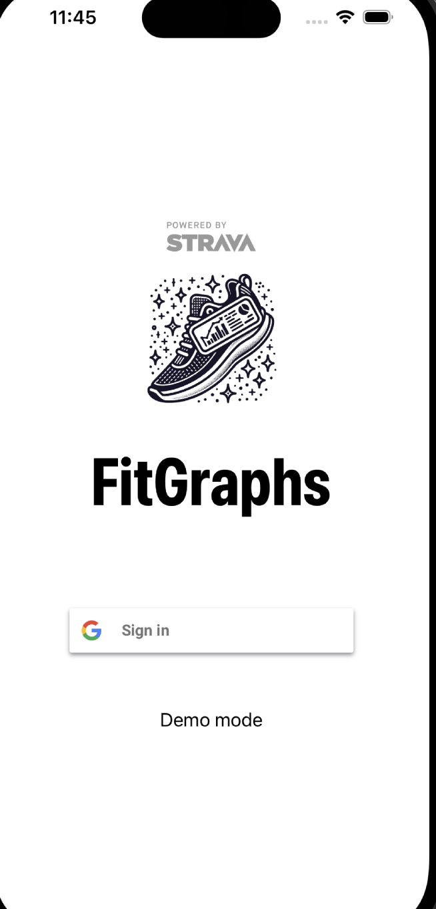
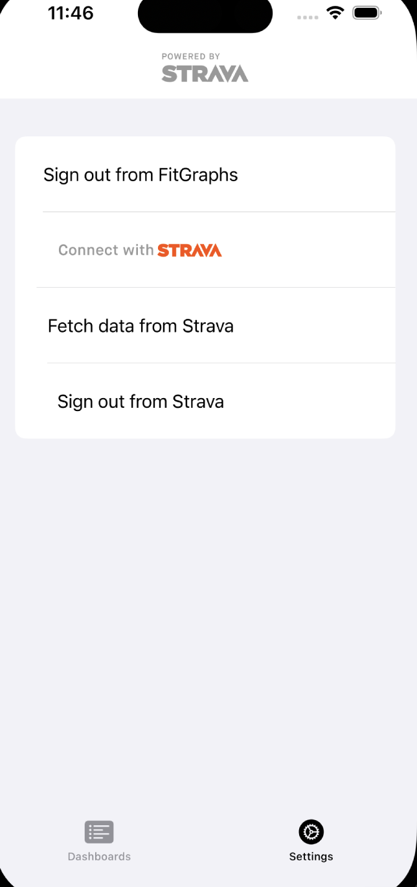
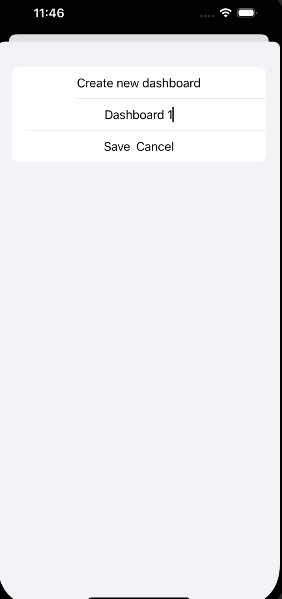
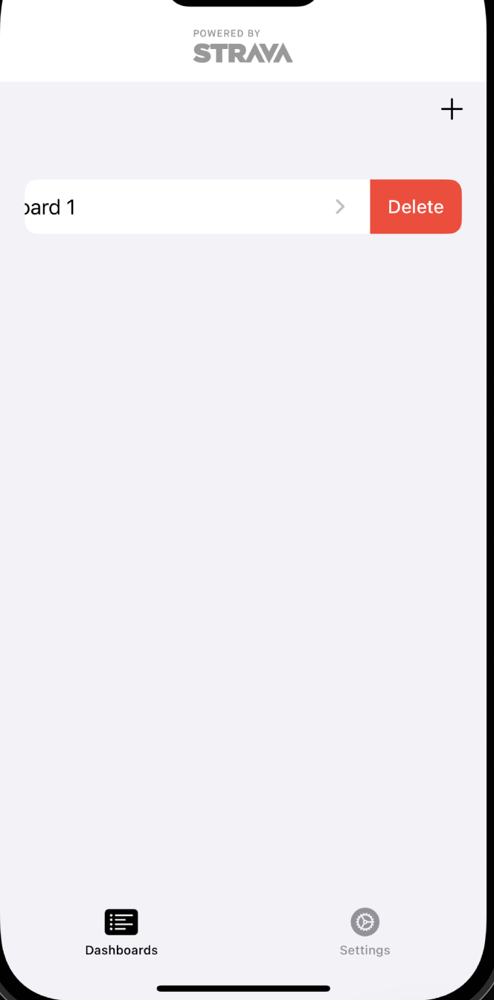
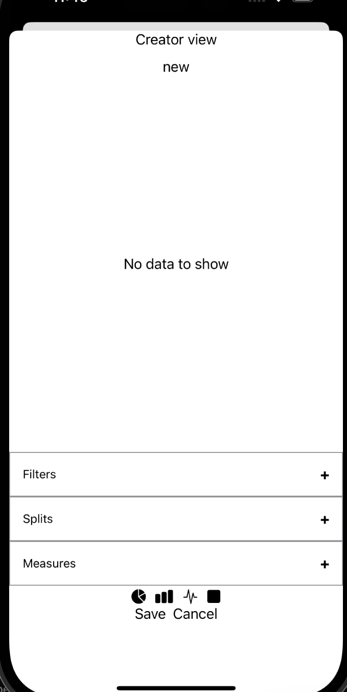
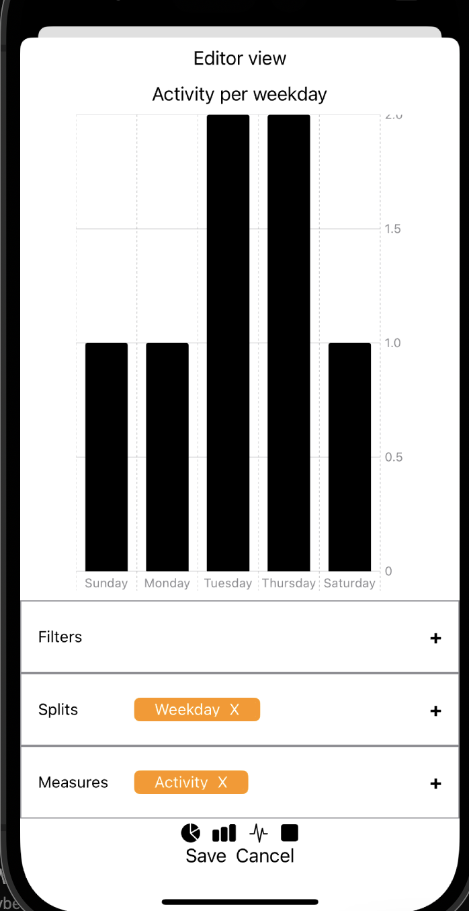
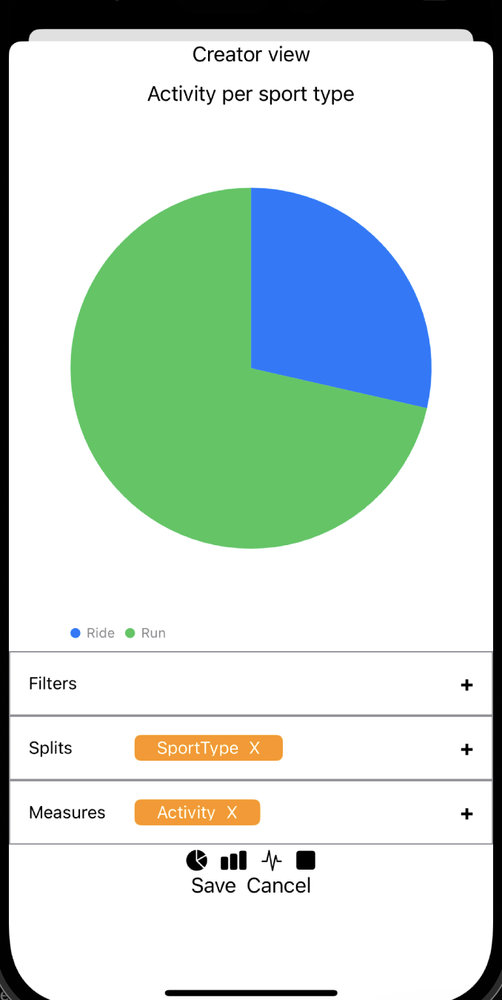
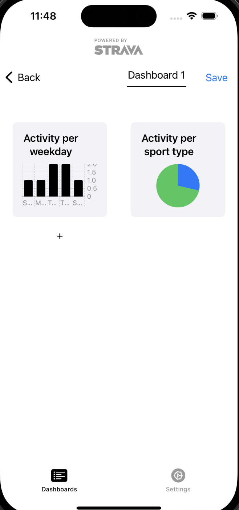

# FitGraphs - instrukcja

## Kompilacja oraz instalacja

Minimalne wymagania

1. iOS 17
2. XCode 15
3. Swift 5.9

```code
git pull https://github.com/szymonorz/FitGraphs.git
```

Otwórz projekt w XCode, zbuduj i uruchom na emulatorze iOS 17.

## Logowanie

FitGraph obsługuje logowanie za pomocą Firebase poprze Google OAuth.
Należy nacisnąć na przycisk `Sign In` i udzielić aplikacji na korzystanie danych z konta.
<div align="center">

</div>

## Pobieranie danych ze Strava

Po zalogowaniu na dole ekranu aplikacji są widoczne dwa widoki `Dashboards` i `Settings`. Należy przejść do `Settings` i nacisnąć w przycisk `Sign in with Strava`. Aplikacja przekieruje do serwisu Strava gdzie należy się zalogować swoim kontem.

Po zalogowaniu należy pobrać dane odnośnie swoich aktywności klikając przycisk `Fetch data from Strava`.

<div align="center">

</div>

## Tworzenie dashboardów

W widoku `Dashboards` w prawym górnym rogu po naciśnieciu na `+` pokaże się widok gdzie można utworzyć nowy panel.

<div align="center">

</div>


Po utworzeniu należy nacisnąć na dashboard i zostanie się przeniesionym w widok edytora panelu, gdzie można tworzyć wykresy oraz zmienić nazwe. 

Aby usunąć dashboard należy przesunąć kafelek z nazwą w lewo i zatwierdzić.

<div align="center">

</div>


## Tworzenie i edycja wykresów.
Aby utworzyć wykres należy nacisnąć na `+` na ekranie. Edycję utworzonego wykresu zaczyna się poprzez
W widoku edytora lub kreatora wykresów są widoczne 3 pola do edycji: `Filters`, `Splits` oraz `Measures`. W `Filters` podajemy filtry, według których chcemy ograniczyć zbiór danych. W `Splits` podajemy wymiary według których mają być grupowane dane. W `Measures` podajemy statystyki, które mają być wyświetlane na wykresie.

<div align="center">

</div>


Pod wybieraczkami znajduje się horyzontalny panel w którym można wybrać jeden z 4 rodzai wykresów: `Bar`, `Line`, `Pie`, `Area`.


Musi być podany conajmniej jeden wymiar w `Splits` oraz tylko jedna miara w `Measures`. Ilosć `Splits` jest zależna od rodzaju wykresu. Wykres `Pie` pozwala tylko na jeden wymiar. `Line` oraz `Area` zezwalają tylko na wymiar `Date`. `Bar` ma maksymalny limit dwóch wymiarów.

<div align="center">


</div>


Po zakończeniu operacji należy zapisać wykres naciskająć przycisk `Save`. Widok nie pozwala zapisać wykresu jeżeli jest on błędny. Komunikaty błędu są wypisywane zamiast wyświetlanego wykresu.

<div align="center">

</div>

## Tryb Demo

Użytkownik ma możliwość przetestować aplikację bez wymogu posiadania konta naciskając w przycisk `Demo Mode` na panelu logowania. Ma tam już przygotowany jeden dashboard z trzema wykresami. Dane dla trybu demo zawierają zakres aktywności z 2023 roku.

## Wylogowanie

Można się kolejno ze Strava oraz aplikacji FitGraphs w widoku `Settings`.
Wylogowanie z `FitGraphs` powoduje również deautoruzację w Strava.